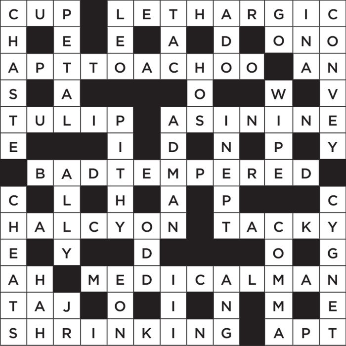
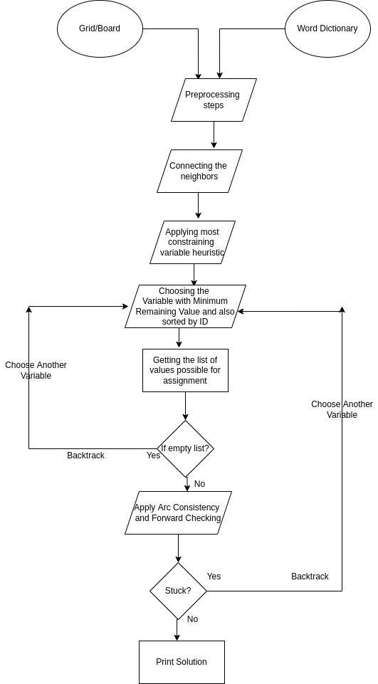

# Crossword-Puzzle-as-CSP

  

---

A puzzle consisting of a grid of squares and blanks into which words are to be filled vertically and horizontally. In the crossword puzzle, we have a grid with blocked and unblocked cells and a dictionary of words. We want to assign a letter to each unblocked cell so that each vertical or horizontal contiguous segment of unblocked cells forms a word that appears in the dictionary. Given a word dictionary consisting of a list of words, we need to fill the blank squares with the alphabets such that every constraint like the word size and the overlapping word constraints are fulfilled. For example in the above image shown, the word dictionary will have a list of words like Cup, chaste, petal, tulip, etc. stored. 

---
# Steps to run the code:

1. Open terminal and go to src by "cd src"
2. Compile cpcsp.java and Placement.java file by "javac *.java"
3. Run the command by "java cpcsp <gridFilewithPath> <wordListFilewithPath>"  (Ex: "java cpcsp ../data/grid1.txt ../data/wordList1.txt")

---
# Aproach:

The crossword puzzle problem can be described as a Constraint Satisfaction problem as follows:-

Variables: All vertical or horizontal contiguous segments of unblocked cells.
Domains: The domain of each variable is the set of words in the dictionary of the same length as the corresponding contiguous segment. 
Constraints: For each pair of vertical and horizontal contiguous segments of unblocked cells that intersect at an unblocked cell s, we add a constraint between them, constraining the words assigned to them to have the same letter at s.

  

